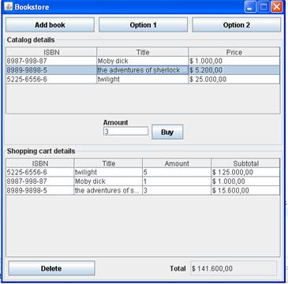

# Description

## Problem Description

The objective is to build an application that handles a bookstore. The store has a
catalog of books that are for sale. Each book has an ISBN which is a unique identifier
for that book a title and a price. The store has an unlimited amount of each book
for sale.

When a client goes to buy a book at the bookstore, he uses a shopping cart. In
this shopping cart he adds the books that he's planning on buying. The client can
buy more than one copy of each book. When checking the bill, the client must be
able to see the total for each book depending on the price and the amount of
copies that he's buying and the grand total for everything. The client can change
his mind and remove items from the shopping cart.

# Interface

